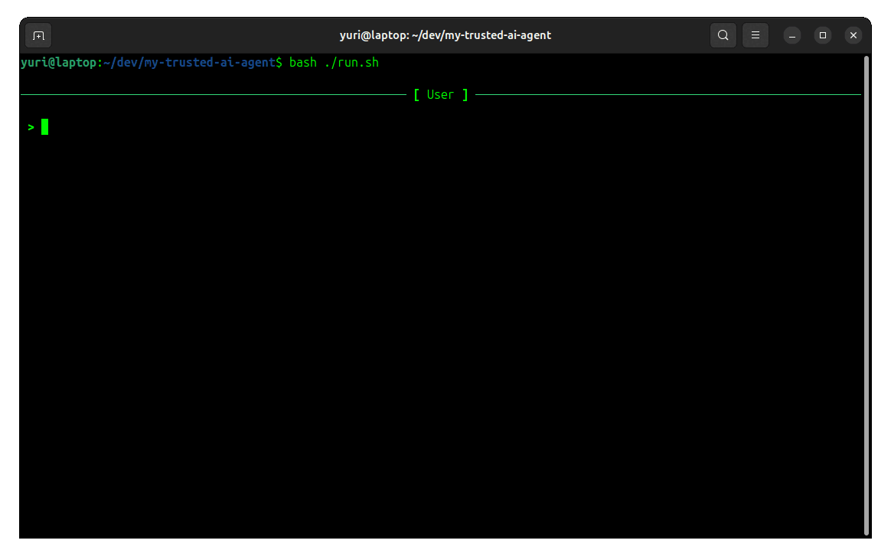
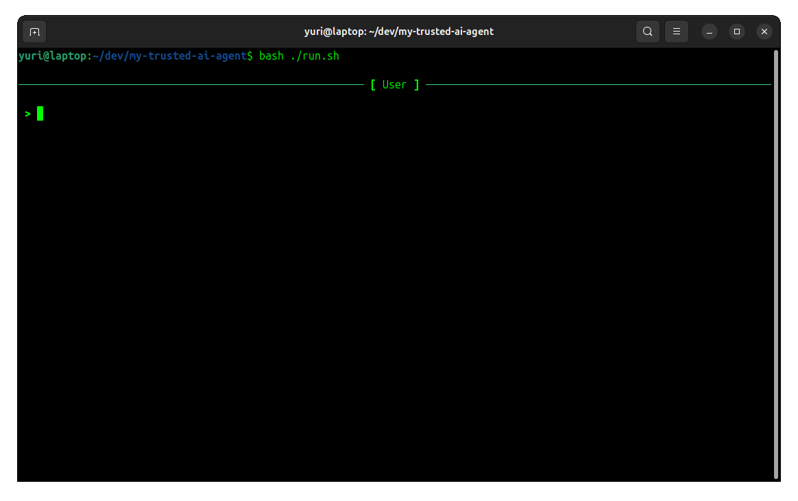

# My Trusted AI Agent

A minimalistic, security-conscious AI assistant designed to keep you - the human - firmly in the driver's seat.

---

## Philosophy

Most AI agent frameworks race toward autonomy - the faster the AI can act without you, the "better." But speed and productivity are not the same thing.

This project takes a different approach: it deliberately brings you along for the ride.

- **You stay in the loop.** Every potentially dangerous action requires your explicit approval. You see what the AI intends to do before it does it, and you can deny it on the spot.
- **You catch mistakes early.** Because the agent pauses for your input at each sensitive step, you can correct course early instead of discovering hours later that the AI went off in the wrong direction.
- **You develop your domain knowledge.** When you approve each tool call, read each output, and follow each decision, you build understanding - rather than letting the AI zoom ahead while you scramble to catch up.
- **You give feedback in real time.** The single linear conversation lets you steer the agent continuously, not just at the start and end of a task.
- **You decide when context is too large.** The agent is honest about context growth - no compression, no summarization, no babysitting. You observe the context length and know when it's time to start fresh before quality deteriorates.
- **You benefit from cache hits.** Because it's a single linear agent with no branching or hidden parallel histories, input cache hits frequently - making this architecture surprisingly cheap to run.
- **Prompt injection is contained.** Since every sensitive action requires your explicit approval, even a compromised model cannot act on its own. A malicious prompt might trick the AI into requesting a harmful tool call, but you see exactly what it intends to do before it happens - and you stop it with Ctrl+C.

---

## Special Commands

| Command | Description |
|---|---|
| `/new [agent_name]` | Starts a new session; optionally selects an agent |
| `/load n [replay]` | Loads a previous session with ID `n`; optionally replays the entire conversation |
| `/system [message]` | Injects a system prompt message into the current session |
| `/rewind` | Rewinds to right before the latest user message |
| `/export` | Exports the session conversation to a Markdown file |
| `/exit` | Closes the application |

---

## Agents

Agent presets define which tools and system instructions the AI receives.

| Agent | Description |
|---|---|
| `default` | Full access to all tools (create, delete, edit, search, etc.) with complete system instructions (language, Markdown, environment info) |
| `raw` | No tools, no system prompts - a blank slate for unrestricted conversation |
| `researcher` | Access to a few tools and system prompts tailored for research |

---

## Security & Permission Model

AI models are susceptible to prompt injection - malicious instructions embedded in web pages, files, or other content the model reads. In most agent frameworks, this gives an attacker direct access to your system through the model's tools.

This project's permission model is your defense: no matter what the model wants to do, it cannot act without your say-so.

The AI agent has access to tools, but not all are equally dangerous. The permission system reflects this.

### Auto-approved (read-only / low-risk)

- Creating directories
- Generating random integers
- Listing directories
- Reading PDF documents from the web
- Reading web pages
- Searching the web

### Requires your manual approval (potentially destructive / sensitive)

- Deleting files/directories/symlinks
- Editing files
- Executing shell commands
- Moving or renaming files/directories/symlinks
- Reading files
- Reading local PDF documents
- Writing files

When a tool requires approval, the AI shows you the exact action it intends to take and waits for you to press `Enter` to confirm. You can interrupt at any time with `Ctrl+C` to deny the action.

---

## Supported AI Models

- **DeepSeek**
  - `deepseek-v4-flash`
  - `deepseek-v4-pro`

---

## How to Run

### Prerequisites

```shell
sudo apt update
sudo apt install -y python3-dev python3-pip python3-venv
```

### Configuration

Copy the example environment file:

```shell
cp .env.example .env
```

Then configure it however you want it.

### Run

```shell
bash ./run.sh
```

---

## Development Scripts

| Script | Purpose |
|---|---|
| `format.sh` | Auto-format the source code |
| `lint.sh` | Run type checking and linting |
| `test.sh` | Run the test suite with coverage report |

---

## Demos




